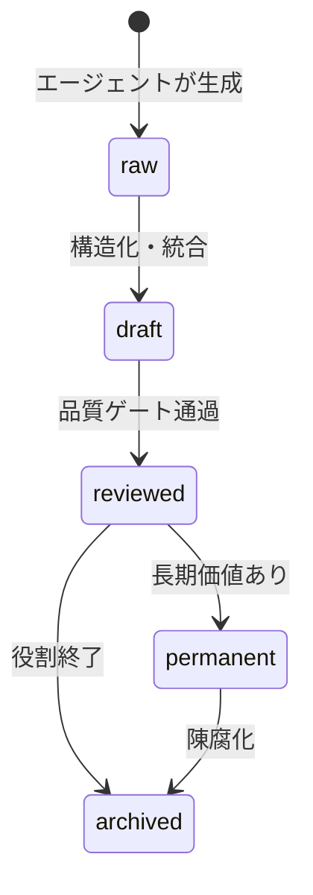
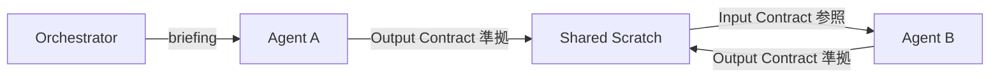
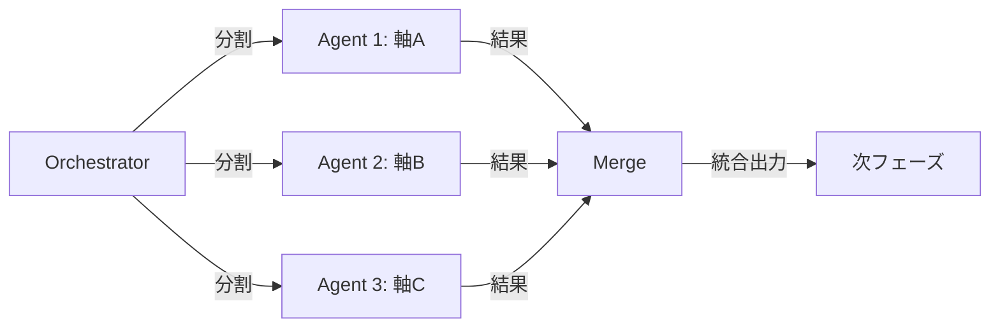
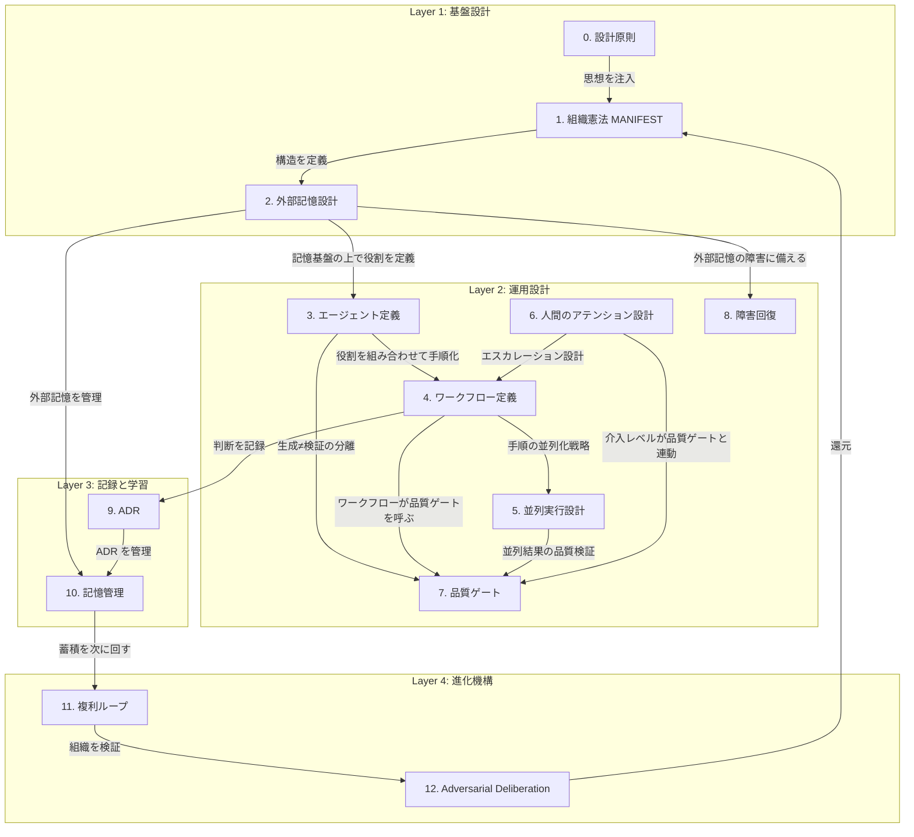

# AIエージェント組織構築テンプレート 設計書 v2.0

> **本書の位置づけ:** AI エージェント組織を構築するための設計参照。特定ツール・プラットフォームに依存しない抽象インターフェースを定義し、現在の正本 scaffold である `scaffold/AI_ORG/` に適用するための拡張指針を示す。

> **読み方:** 実運用の正本は `scaffold/AI_ORG/` であり、本書は設計参照・拡張参照として扱う。日常利用の入口は `README.md`、仕事PCでの最小導入は `daily-use-minimal-kit.md`、用途別の拡張は `ai-agent-org-onboarding-guide.md` を参照する。本書を最初から全実装する必要はなく、迷った設計判断の根拠を確認するために戻ってくる。

> **窓口と最終応答:** ユーザーとの入出力は Orchestrator に集約する。Orchestrator の役割、Single Ingress Rule、最終応答前の Deliberation Gate は `orchestrator.md` を正本とする。

---

## 0. 設計原則

**対応する問い:** 全9問の前提

### 目的

本セクションは設計書全体を貫く2つの思想を定義する。以降の全セクションはここに立ち返る。

### 第0条: 出力品質が北極星

組織の存在意義は「優れたアウトプットを出すこと」であり、使いやすさ・体裁・ノリの良さではない。設計判断に迷ったとき、出力品質を最も高める選択を取る。

### 揮発性の公理

AI エージェントはセッションごとに記憶が消える（Volatility）。人間の組織では個人の経験が蓄積されるが、AI 組織では個体が何も覚えていない状態から毎回始まる。この性質から3つの帰結が導かれる:

1. **組織が覚える:** 個体が覚えられないなら、外部記憶と構造化されたプロトコルで組織として記憶を保持する。
2. **複利を組み込む:** 回すほど仕組み自体が賢くなるループを設計に組み込む。揮発する個体ではなく「仕組み」をベテランにする。
3. **フレッシュ視点の武器化:** 毎回白紙で起動するからこそ、過去のバイアスに汚染されない。揮発性は「補うべき弱点」であると同時に「活かすべき武器」でもある。

#### 帰結3: フレッシュ視点の設計論

揮発性が失わせるもの（経験の蓄積）は帰結1・2で補う。しかし揮発性が与えるもの -- 先入観のない判断 -- は意図的に活用すべきである。

- **セカンドオピニオンの純度:** 意図的に記憶を注入しないことで、第三者視点の純度を保てる。先行分析の結果を渡さずに同一タスクを投げれば、独立した見解が得られる。
- **バイアス遮断の構造化:** Adversarial Deliberation Protocol（セクション12）で verdict のみ渡し、検討過程を渡さないのはこの原則の応用。過去の議論を引き継ぐと、外部攻撃者が「内部者化」してしまう。
- **「いつ記憶を渡し、いつ渡さないか」の判断基準:**
  - **渡す:** タスクの遂行に必要なコンテキスト（Input Contract、前工程の出力、制約条件）
  - **渡さない:** 独立した評価が欲しいとき（品質ゲートの Critic、競争的並列の各エージェント、Adversarial Deliberation の外部攻撃者）
  - **判断基準:** 「この情報を渡すことで、このエージェントの出力が先行者の結論に引きずられるリスクがあるか?」に Yes なら渡さない。

### 対象者

AI を道具として十分に使い込み、次に「組織として構造化する」段階にある上級者。初学者向けの導線は本質ではない。

### アンチパターン

- **AP-0a: 個体依存。** 特定エージェントの「経験」に頼る設計。セッションが切れた瞬間に消える。
- **AP-0b: 装飾過剰。** 出力品質に寄与しない体裁・フォーマット・儀式の追加。設計コストは出力品質に換算せよ。
- **AP-0c: 暗黙の前提。** 「前のセッションでやったはず」という期待。明示的に外部記憶に書かれていない限り、存在しない。
- **AP-0d: コンテキスト無限仮定。** エージェントに渡す情報量に上限がないかのように設計する。実際にはコンテキストウィンドウには物理的上限があり、MANIFEST + エージェント定義 + Scratch + 検索結果の合計がウィンドウを圧迫する。注入する情報には優先順位と圧縮が必要。
- **AP-0e: 過剰な記憶注入。** 独立した判断が必要な場面で前工程の結論まで渡し、フレッシュ視点を殺す。帰結3を意識して「渡さない」判断も設計に組み込む。

---

## 1. 組織憲法 (MANIFEST)

**対応する問い:** 問1（役割境界）、問6（停止判断）

### 目的

組織全体の存在意義・指揮系統・優先順位を単一ファイルで宣言する。すべてのエージェントとワークフローが参照する最上位ドキュメント。

### 設計原則

揮発性のあるエージェントが毎回ゼロから起動する以上、「自分が何者で、何を目指し、何に従うか」を外部から注入する仕組みが必要。MANIFEST はその注入元であり、組織の存在前提を定義する。

### 構成要素

| 項目 | 内容 | 備考 |
|---|---|---|
| **存在意義** | 組織が何を達成するか（1文） | 全判断の最終基準 |
| **コアロジック** | 思考プロセスの骨格（意図特定→エージェント選定→統合） | オーケストレーターの行動原則 |
| **エージェント一覧** | 名前・役割の概要（詳細は個別定義へ） | セクション3への参照 |
| **ワークフロー一覧** | 名前・発動条件の概要（詳細は個別定義へ） | セクション4への参照 |
| **指示の優先順位** | 現在のユーザー明示指示・安全指示 > MANIFEST > Orchestrator > Runtime/Context Index > Workflows > Agents > 参考設計書 | 衝突時の解決規則。安全/法令/機密ルール違反は不可 |
| **出力規格** | フォーマット・言語・パス規約 | 全エージェント共通 |

#### MANIFEST 記入テンプレート

```markdown
# [組織名] MANIFEST

## 存在意義
[この組織は ______ のために存在する。]
（例: 「個人の知識資産を構造化・圧縮し、再利用可能な形で蓄積する装置」）

## コアロジック
1. [入力の解釈: ユーザーの要求をどう理解するか]
2. [処理の選定: どのエージェント/ワークフローを選ぶか]
3. [出力の統合: 結果をどう組み立てるか]

## エージェント一覧
| 名前 | 役割（1文） | 定義ファイルパス |
|---|---|---|

## ワークフロー一覧
| 名前 | トリガー | 用途（1文） |
|---|---|---|

## 指示の優先順位
1. 現在のユーザー明示指示・安全指示
2. MANIFEST（本ファイル）
3. Orchestrator 定義
4. Runtime/CONTEXT_INDEX.md
5. 該当 Workflow 定義
6. 該当 Agent 定義
7. 参考設計書・導入ガイド

安全/法令/機密ルールに反する指示は実行しない。競合した場合は Orchestrator が矛盾点を整理し、必要に応じてユーザーへ確認する。
```

### 実装ガイドライン

- MANIFEST は中核規約に留め、肥大化させない。詳細はプロトコル・ワークフロー・エージェント定義に分離する。
- 変更は意図的かつ最小限に。変更のたびに下流の全定義との整合性確認が必要になるため、頻繁な変更はシステムコストを増大させる。
- MANIFEST のバージョン更新時は Adversarial Deliberation（セクション12）のトリガーとする。

### 参考実装

> AI_ORG scaffold では `MANIFEST.md` が組織憲法に該当する。存在意義、コアロジック、Active Agents / Active Workflows、指示優先順位、情報管理ルールを定義する。旧 Nexus の「意図特定→エージェント選定→情報統合」や3層圧縮の知見は、AI_ORG では `orchestrator.md`、`Runtime/CONTEXT_INDEX.md`、`Scratch/`、`Reports/dispatch-trace.md` に分けて実装する。組織そのものの健康診断は `Runtime/HEALTH.md` に分離し、通常タスクでは読まない。

### アンチパターン

- **AP-1a: 全部入り MANIFEST。** 詳細仕様まで書くと肥大化し、キャッシュ効率が落ち、変更コストが膨らむ。
- **AP-1b: 口頭伝承。** 「こういう運用にしよう」がドキュメント化されず、セッション間で消える。

---

## 2. 外部記憶設計

**対応する問い:** 問4（決定記憶）、問5（記憶の信頼性）

### 目的

揮発性の公理に対する根本解。エージェントの外側に、構造化・検索可能・人間監査可能な記憶層を構築する。

### 設計原則

個体が覚えられない以上、組織の知的資産はすべて外部記憶に存在する。この層の設計品質が組織全体の出力品質の天井を決める。記憶は「書いて終わり」ではなく、ライフサイクルを持ち、腐敗し、メンテナンスを要する生き物として扱う。

### 2.1 要件定義（5要件）

| # | 要件 | 根拠 |
|---|---|---|
| 1 | **構造化フィルタ可能** | メタデータ（型・状態・タグ・日付）で機械的に絞り込める |
| 2 | **人間が監査可能** | プレーンテキスト形式で、専用ツールなしに内容を確認できる |
| 3 | **ライフサイクル追跡** | 各ノートが今どの段階（raw → draft → reviewed → permanent → archived）にあるか明示 |
| 4 | **インデックス再構築可能** | インデックスが破損しても、元データから再生成できる |
| 5 | **エージェント間共有** | 全エージェントが同一の記憶層を読み書きする単一ソース |

### 2.2 メタデータスキーマ

すべてのノートに以下の frontmatter を付与する:

```yaml
---
title: "ノートのタイトル"
note_type: reference | report | memory | decision | digest  # 組織の用途に合わせてカスタマイズ可
status: raw | draft | reviewed | permanent | archived
tags: [kebab-case-tag, category/subcategory]
date: YYYY-MM-DD        # 作成日
updated: YYYY-MM-DD     # 最終更新日
---
```

- `note_type` はノートの性質を分類し、検索フィルタの第一軸になる。旧運用知見では `recon-report`（偵察レポート）、`session-memory`（セッション記憶）等の具体名を使用していた。
- `status` はライフサイクル上の位置を示す。
- `updated` は鮮度判定（セクション10の半減期）の基準になる。

### 2.3 ノートのライフサイクル



- **raw:** エージェントが生成した未加工の素材。偵察リサーチ(Recon)の出力など。
- **draft:** 統合・構造化されたが、品質検証を経ていない。
- **reviewed:** 品質ゲート（Critic）を通過し、信頼できる状態。
- **permanent:** 長期的に参照価値がある知識資産。昇格は人間の承認が必要。
- **archived:** 役割を終えたが、履歴として保持。削除は原則しない。

### 2.4 リンク構造設計（型付きリンク）

ノート間の関係性を型付きリンクで明示し、関係の意味を記録する。追加コストゼロでナレッジグラフを構築し、複利ループ C の基盤となる。詳細は「付録D: 外部記憶設計の詳細」を参照。

### 2.5 タグ統制語彙

`kebab-case` 形式の登録制。自由生成を許すとエントロピーが増大し、検索精度が崩壊する。詳細は「付録D: 外部記憶設計の詳細」を参照。

### 2.6 スケール時の拡張オプション

標準構成はファイルベース + 構造化インデックス + 型付きリンク（50-200ノート規模）。500ノート超でベクトル検索やインデックス分割を検討する。詳細は「付録D: 外部記憶設計の詳細」を参照。

### アンチパターン

- **AP-2a: タグの野放し。** 登録制なしで自由にタグを作ると、数ヶ月で表記揺れだらけになり検索が死ぬ。
- **AP-2b: リンクなしの孤島ノート。** 他のノートと繋がらないノートは発見されず、腐敗する。
- **AP-2c: ステータス放置。** `raw` のまま放置されたノートが溜まると、信頼できるノートとの区別がつかなくなる。

---

## 3. エージェント定義と情報伝達

**対応する問い:** 問1（役割境界）、問2（情報伝達プロトコル）

### 目的

「誰が何をし、何をしないか」を厳密に定義し、エージェント間の情報伝達を契約ベースで保証する。

### 設計原則

揮発性のあるエージェントに対して、毎回「お前は何者で、何を受け取り、何を返すか」を外部から注入する必要がある。曖昧な役割分担は、品質劣化の最大要因になる。特に危険なのは「越境」 -- あるエージェントが前後工程の仕事を勝手にやること。

### 構成要素: エージェント定義

各エージェントは以下の構造で定義する:

```
# Agent: [名前]（[日本語名]）

## Role
1文で存在理由を述べる。

## Responsibilities
番号付きリストで責務を列挙する。

## Input Contract（入力契約）
- このエージェントが受け取る前提条件
- 前工程が満たすべきデータ・フォーマット
- 契約違反時のフォールバック（差し戻し先）

## Output Contract（出力契約）
- 必須フィールドの一覧（フィールド名・型・説明）
- 出力フォーマット

## 役割境界（厳守）
- やらないことを明示する（前工程のやり直し、後工程の先食い）

## モデル推奨（任意）
- このエージェントに適したモデル特性（品質優先 / 速度優先）
- 付録C: マルチモデル運用とコスト最適化のモデル選択指針を参照
```

#### Input/Output Contract の記入例

```yaml
# Input Contract（調査エージェントの例）
input:
  - field: topic
    type: string
    description: "調査対象のトピック（1文）"
    required: true
  - field: scope
    type: string
    description: "調査の範囲と深さの指定"
    required: true
  - field: existing_notes
    type: list[path]
    description: "Librarian が収集した既存ノートのパス一覧（空リスト可）"
    required: false
contract_violation: "必須フィールド欠落 → オーケストレーターに差し戻し"

# Output Contract（調査エージェントの例）
output:
  - field: findings
    type: "list[{claim: string, source: url, reliability: G|S|A|R}]"
    description: "調査結果のリスト。各項目に出典と信頼度を付与"
  - field: summary
    type: string
    description: "300字以内の要約"
  - field: coverage_gaps
    type: list[string]
    description: "調査しきれなかった領域"
contract_violation: "必須フィールド欠落 → 品質ゲートが自動 FAIL"
```

### 典型的な役割分担（テンプレート）

| 役割 | 責務 | やらないこと |
|---|---|---|
| **Librarian（司書）** | 既存記憶の検索・カバレッジ報告 | 外部調査、分析 |
| **Investigator（調査員）** | 外部情報の収集・信頼性評価 | Vault 内検索、統合分析 |
| **Analyst（分析官）** | 情報の統合・構造化・洞察抽出 | 収集のやり直し、品質判定 |
| **Critic（査読官）** | 品質検証・バイアスチェック | 内容の生成、修正の実行 |
| **Scribe（書記官・任意追加）** | 整形・保存・記帳 | 内容の創造・補正 |
| **Curator（学芸員）** | Vault 全体の健全性維持 | 知識ノートの新規作成（レポート等の一時成果物は含まない） |

`scaffold/AI_ORG/` の初期 Active Agents は Orchestrator / Worker / Critic である。Scribe は初期必須ではなく、保存・整形・Frontmatter 付与・索引更新が頻発して Orchestrator から分離したくなった時点で追加する。

### 情報伝達プロトコル

エージェント間の情報受け渡しは**共有ワークスペースファイル**（Scratch）を介する。直接的なメモリ共有やコンテキスト引き継ぎに依存しない。



- **ブリーフィング:** オーケストレーターがタスク・前提・出力契約・完了条件を明示的に指示する。ブリーフィングの品質原則は「付録F: プロンプトエンジニアリング原則」を参照。
- **Scratch（共有ワークスペース）:** 全フェーズの出力が蓄積される中間ファイル。各エージェントは自分のセクションに書き、前工程のセクションを読む。並列実行時のアクセス設計はセクション5を参照。

### コンテキスト効率化

エージェントに渡すコンテキスト量には物理的上限がある。以下の戦略で管理する:

- **Static Layer（低変動）:** MANIFEST、エージェント定義、プロトコル。キャッシュ効率を保つため変更を最小化する。
- **Dynamic Layer（高変動）:** ユーザークエリ、Scratch、検索結果。コンテキスト末尾に配置する。
- **3層圧縮:** フェーズ完了後、Dynamic Layer を `intent + key_findings + decision_rationale` の3フィールドに圧縮して次フェーズへ渡す。生データ・中間メモ・却下案は破棄する。3層圧縮はコスト最適化の観点からも有効 -- 不要なトークン消費を削減し、高品質モデルの使用コストを抑える（付録C: マルチモデル運用とコスト最適化 参照）。

### 参考実装

> AI_ORG scaffold では各エージェントを `Agents/[name].md` に定義し、初期状態では `Agents/worker.md` と `Agents/critic.md` を用意する。ブリーフィングは Orchestrator が `Workflows/execute.md` に沿って組み立て、必要に応じて `Scratch/YYYY-MM-DD-task-name.md` に作業状態を残す。

エージェントの Output Contract は実行トレース（セクション10, 層1）の記録対象であり、複利ループ A（観測→改善）の入力となる。出力品質のパターンが蓄積されることで、エージェント定義やブリーフィングの改善に繋がる。

### アンチパターン

- **AP-3a: 役割の越境。** Investigator が分析まで踏み込む、Critic が内容を書き換える等。品質責任の所在が曖昧になる。
- **AP-3b: 口頭ブリーフィング。** 「前のやつの続きで」のような曖昧な指示。揮発性のあるエージェントには毎回、完全なコンテキストを渡す。
- **AP-3c: Output Contract 省略。** 出力形式が自由だと、後工程が受け取れずに手戻りが発生する。

---

## 4. ワークフロー定義

**対応する問い:** 問1（役割境界）、問6（エスカレーション・停止判断）

### 目的

「どのエージェントを、どの順序で、どの条件で呼ぶか」を再現可能な手順として定義する。

### 設計原則

揮発性のある個体に依存せず、手順書そのものが品質を保証する。ワークフローは組織の「筋肉記憶」 -- 個人が忘れても手順が覚えている。

### 構成要素: ワークフロー定義

```
# Workflow: [名前]

## Objective
何を達成するか（1文）

## 発動条件
いつ・誰がトリガーするか

## 複雑度ルーター（該当する場合）
入力の性質に応じて dispatch 構成を切り替える判定基準
```

#### 複雑度ルーターのテンプレート

```yaml
complexity_router:
  - condition: "[判定条件（入力の特徴）]"
    level: "Simple"
    dispatch: "[使用するエージェント構成]"
  - condition: "[判定条件]"
    level: "Standard"
    dispatch: "[使用するエージェント構成]"
  - condition: "[判定条件]"
    level: "Full"
    dispatch: "[使用するエージェント構成]"
  default: "Standard"
```

#### 記入例

| 条件 | 複雑度 | dispatch 構成 |
|---|---|---|
| 軽い整理・作成で Vault 検索が不要 | Simple | Worker → Critic（light） → Orchestrator finalization |
| Vault が有効化済みで既存ノートのカバレッジ十分 | Simple | Librarian → Critic（light） → Orchestrator finalization |
| 外部調査が必要 | Standard | Investigator → Analyst → Critic → Orchestrator finalization（Vault 有効時のみ Librarian、必要なら Scribe） |
| 多軸並列調査が必要 | Full | Investigator × N（並列） → Analyst → Critic → Orchestrator finalization（Vault 有効時のみ Librarian、必要なら Scribe） |

#### 判定の手順

オーケストレーターは以下の手順で複雑度を判定する:

1. **Vault の有効/無効を確認する:** Vault 未構築または無効なら Librarian を使わず、Worker / Investigator の軽量経路から始める
2. **Vault が有効なら Librarian に検索させる:** ユーザーの質問の主要要素（キーワード・対象・観点）を特定し、Vault を検索
3. **カバレッジを評価する:**
   - 主要要素の全てに対応するノートがあり、最新（updated が90日以内）→ **Simple**
   - 主要要素の一部にノートがあるが、不足部分がある → **Standard**
   - 独立した調査軸が3つ以上あり、各軸が互いに依存しない → **Full**
4. **迷ったら Standard:** 判断がつかない場合は Standard で開始し、必要に応じて Full に昇格する（逆は難しいため）

```
## フェーズ定義
各フェーズの担当エージェント・入力・出力・完了条件
```

#### フェーズ記述テンプレート

```yaml
phase_N:
  name: "[フェーズ名]"
  agent: "[担当エージェント名]"
  input: "[前フェーズの出力 / ユーザー入力]"
  output: "[Scratch のどのセクションに何を書くか]"
  done_when: "[完了条件]"
  fallback: "[失敗時の遷移先]"
  execution_mode: "sequential | parallel"  # セクション5の並列設計を参照
```

> **デフォルト完了条件:** 全てのフェーズの `done_when` には、明示的な完了条件に加えて「Output Contract の必須フィールドが全て存在すること」が暗黙に含まれる。オーケストレーターはフェーズ完了時に Output Contract の必須フィールド存在を確認し、欠落がある場合はフォールバックに遷移する。品質ゲート（Critic）到達前の早期検出により、手戻りコストを削減する。

#### 最小ワークフロー例: 調査→査読（2フェーズ）

```yaml
workflow: MinimalResearch
trigger: "〜を調べて"
complexity_router: なし（単一構成）

phase_1:
  name: "調査"
  agent: "investigator"
  input: "ユーザーの調査依頼（トピック + スコープ）"
  output: "Scratch#findings に調査結果リストを書く"
  done_when: "findings が3件以上、全件に出典URLあり"
  fallback: "件数不足 → オーケストレーターがスコープを拡大して再dispatch"

phase_2:
  name: "査読"
  agent: "critic"
  input: "Scratch#findings"
  output: "Scratch#review に GSAR 判定付きレビューを書く"
  done_when: "Rejected 項目がゼロ、または修正指示が明記されている"
  fallback: "Rejected あり → phase_1 に差し戻し（最大2回）"
```

```
## Scratch 状態契約
frontmatter（workflow, topic, status, started, phase_done）と更新規則

## エスカレーション条件
どの状態になったら上位（オーケストレーター or 人間）に戻すか

## 停止条件
ループの上限回数、品質ゲート FAIL 時の打ち切り基準

## Safety Rules
やってはいけないこと（破壊的変更の制限等）
```

### エスカレーションと停止判断

| 条件 | アクション |
|---|---|
| Agent が Input Contract 違反を検出 | 前フェーズに差し戻し（自動） |
| Critic が FAIL 判定 | Analyst に修正指示を返す（自動、最大2回） |
| 修正ループが上限回数に到達 | オーケストレーターに返却し、人間にエスカレーション |
| 破壊的変更（削除・上書き）が必要 | 人間の承認を待つ（セクション6の介入レベル参照） |
| 外部依存（API・サービス）が応答しない | 待機→タイムアウト→人間に報告 |

### Scratch 状態契約

ワークフローの進捗は Scratch ファイルの frontmatter で管理する:

```yaml
---
workflow: [ワークフロー名]
topic: "[トピック]"
status: in-progress | complete | failed
started: YYYY-MM-DD
phase_done: [0, 1, 2]  # 完了済みフェーズ番号
---
```

- `status: in-progress` のまま3日以上残留 → 中断再開候補として検出。
- `status: complete` なのにアーカイブされていない → 記帳漏れとして検出。
- frontmatter なし → `legacy` として後方互換扱い。

Scratch の状態遷移と各フェーズの所要時間は実行トレース（セクション10, 層1）に記録され、複利ループ A（観測→改善）のデータソースとなる。「どのフェーズが毎回遅いか」「どのフェーズで差し戻しが多いか」のパターン検出に使う。

### 参考実装

> AI_ORG scaffold では、まず `Workflows/execute.md` の直列フロー（Briefing → Worker → Critic → Revise → Finalize）を正本として使う。Research などの用途別ワークフローを追加する場合は `Workflows/standard-research.md` のように追加し、作業状態は `Scratch/YYYY-MM-DD-task-name.md`、実行の高レベル記録は必要に応じて `Reports/dispatch-trace.md` に残す。

### アンチパターン

- **AP-4a: 無限ループ。** 修正→再査読のサイクルに上限がない。最大2-3回に制限する。
- **AP-4b: ワークフロー未定義の作業。** 「いい感じにやって」で始めると、品質が属人的になる。
- **AP-4c: Scratch 放置。** 完了した Scratch がアーカイブされず溜まると、次回起動時のノイズになる。

---

## 5. 並列実行設計

**対応する問い:** 問8（並列性の活用）

### 目的

AI 組織が人間組織に対して持つ最大の構造的優位 --「同一時刻に同一品質の専門家を任意数生成できる」-- を活かすための設計論。直列実行のみの組織は、この優位を捨てている。

### 設計原則

人間組織では専門家の数がボトルネックになる。AI 組織ではならない。同一エージェント定義から任意の数のインスタンスを同時生成でき、各インスタンスは同一品質で動作する。この性質を構造的に活用することで、品質の向上（多角的検証）と速度の向上（並列処理）の両方を同時に達成できる。

### 5.1 並列パターンの分類

#### Fan-out / Fan-in

1つのタスクを独立したサブタスクに分割し、複数のエージェントが並列処理した後、結果を統合する。



- **用途:** 多軸調査（技術面・法律面・コスト面を同時に調べる）、大規模ドキュメントのセクション別分析
- **前提条件:** サブタスクが互いに独立していること（あるエージェントの出力が別のエージェントの入力に必要でないこと）

#### 競争的並列

同じタスクを複数のエージェントに独立して投げ、最良の結果を採用する。

- **用途:** セカンドオピニオンが欲しい場合、重要な判断の信頼度を上げたい場合
- **要点:** 各エージェントに他のエージェントの出力を渡さない（帰結3: フレッシュ視点の武器化）。先行結果を見せると独立性が失われる。
- **選択基準:** 品質ゲート（Critic）に両方の出力を渡して比較評価させるか、人間が選択する。

#### 探索的並列

異なる仮説やアプローチを同時に検証する。どの方向が正しいか事前に分からない場合に有効。

- **用途:** 原因調査（複数の仮説を同時に検証）、設計検討（複数アーキテクチャを同時にプロトタイプ）
- **要点:** 全探索が成功する必要はない。行き止まりも「この方向は無理」という価値ある情報。
- **統合:** 各探索の結果を Analyst が統合し、最も有望な方向を選定する。

#### パイプライン並列

フェーズ間のオーバーラップ。前フェーズが完全に完了する前に、完了した部分から次フェーズを開始する。

- **用途:** 大規模タスクで全体のリードタイムを短縮したい場合
- **制約:** 前フェーズの部分出力が次フェーズの Input Contract を満たしている必要がある。部分出力の定義を事前に合意する。
- **リスク:** 前フェーズの後半で前半の結果を覆す発見があった場合、次フェーズの手戻りが発生する。

### 5.2 並列オーケストレーション設計

#### 分割戦略

タスクをどう分割するかは並列実行の品質を決定する最重要の判断。

```yaml
# 分割戦略テンプレート
split_strategy:
  method: "axis | segment | hypothesis | competitive"
  splits:
    - id: "split_1"
      scope: "[このエージェントが担当する範囲]"
      agent: "[エージェント名]"
      scratch_section: "[Scratch 内の専用セクション名]"
    - id: "split_2"
      scope: "[担当範囲]"
      agent: "[エージェント名]"
      scratch_section: "[専用セクション名]"
  independence_check: "[分割間に依存関係がないことの確認]"
```

**分割の判断基準:**
- **軸分割（axis）:** 調査対象が複数の独立した観点を持つ場合（技術・法律・コスト等）
- **セグメント分割（segment）:** 大規模データを物理的に分割する場合（文書の前半/後半等）
- **仮説分割（hypothesis）:** 複数の仮説を同時に検証する場合
- **競争分割（competitive）:** 同一タスクを独立して実行させる場合

#### 統合戦略

並列結果をどうマージするかを事前に定義する。統合なき並列は混沌を生む。

```yaml
# 統合戦略テンプレート
merge_strategy:
  method: "concat | synthesize | select_best | vote"
  merge_agent: "[統合担当エージェント名（通常 Analyst）]"
  conflict_resolution: "[結果間で矛盾がある場合の解消方法]"
  output_format: "[統合後の出力フォーマット]"
```

| 統合方法 | 用途 | 適合パターン |
|---|---|---|
| **concat** | 各結果を単純結合 | セグメント分割（結果が互いに排他的） |
| **synthesize** | 各結果を横断分析して統合見解を生成 | 軸分割（複数観点の統合が必要） |
| **select_best** | 最良の結果を選択 | 競争的並列 |
| **vote** | 多数決または重み付き投票 | 仮説検証（複数の独立した評価を集約） |

#### 部分失敗時のハンドリング

N 体中 M 体が失敗した場合の対処を事前に定義する。

```yaml
# 部分失敗ハンドリングテンプレート
partial_failure:
  total_agents: N
  minimum_success: "[続行に必要な最低成功数]"
  on_partial_fail: "continue_with_available | retry_failed | escalate"
  retry_limit: 1
  degradation_notice: "[品質劣化の旨を出力に明記するか: true/false]"
```

- **continue_with_available:** 成功した結果のみで統合を進める。出力に「M 軸中 K 軸のみカバー」と明記する。
- **retry_failed:** 失敗したエージェントのみ再実行する。全体を巻き戻さない。
- **escalate:** 失敗数が閾値を超えた場合、オーケストレーターまたは人間にエスカレーションする。

### 5.3 Scratch の並列アクセス設計

並列実行時、複数エージェントが同一の Scratch に同時書き込むと競合が発生する。以下の設計で回避する。

#### セクション分割方式

各エージェントに Scratch 内の専用セクションを割り当てる。他エージェントのセクションは読み取り専用。

```markdown
# WORKFLOW_SCRATCH_[topic].md

## Metadata
workflow: CompileResearch
status: in-progress
splits: [axis_tech, axis_legal, axis_cost]

## axis_tech（Agent 1 専用）
[Agent 1 がここに書く]

## axis_legal（Agent 2 専用）
[Agent 2 がここに書く]

## axis_cost（Agent 3 専用）
[Agent 3 がここに書く]

## merged（統合フェーズで Analyst が書く）
[並列完了後に統合結果を書く]
```

#### 個別ファイル方式

大規模並列（4体以上）の場合、Scratch 自体を分割する。

- 各エージェント: `WORKFLOW_SCRATCH_[topic]_[axis].md` に書く
- 統合フェーズ: Analyst が全ファイルを読み、`WORKFLOW_SCRATCH_[topic]_merged.md` に統合する

#### マージプロトコル

1. **完了判定:** 全並列エージェントの完了を確認する。完了の条件は以下の両方を満たすこと:
   - Scratch の該当セクション/ファイルに出力が存在する
   - Output Contract の必須フィールドが全て埋まっている（部分出力でないこと）
   
   必須フィールドが欠落している場合は「部分失敗」として扱い、部分失敗ハンドリング（5.2）に遷移する。
2. 部分失敗がある場合、部分失敗ハンドリングに従う。
3. 統合担当エージェント（Analyst）を起動し、統合戦略に従ってマージする。
4. マージ結果を `merged` セクション（またはマージ用 Scratch）に書く。
5. 後続の品質ゲートは `merged` セクションを対象とする。

### 5.4 直列 vs 並列の判断基準

| 判断軸 | 並列にすべき | 直列にすべき |
|---|---|---|
| **依存関係** | サブタスク間に依存がない | 前工程の出力が次工程の入力に必要 |
| **品質要求** | 独立した多角的検証が必要 | 文脈の連続性が品質を決める |
| **時間制約** | リードタイムの短縮が優先 | 各工程の丁寧さが優先 |
| **コスト** | 並列化のコスト増が品質/速度向上に見合う | コスト増に見合う改善がない |
| **統合の複雑度** | 結果のマージが明確に定義できる | マージ方法が不明確で混沌を招く |

**コスト/品質トレードオフのフレーム:**
- 並列化はエージェント数に比例してコストが増える（N 体並列 ≒ N 倍のトークン消費）。
- 競争的並列は最もコストが高い（全エージェントが全工程を実行するため）。Fan-out / Fan-in は各エージェントが部分タスクのみ実行するため、オーバーヘッドは統合コストのみ。
- **判断基準:** 「この並列化で得られる品質/速度の向上は、追加コストに見合うか?」を毎回問う。

### 参考実装

> AI_ORG に Fan-out / Fan-in を追加する場合は、各調査軸に `Scratch/YYYY-MM-DD-[topic].md` を分け、統合担当が全 Scratch を読んで `Scratch/YYYY-MM-DD-[task]-merged.md` などに統合結果を書く。Critic は統合結果だけを査読し、必要なら `Reports/dispatch-trace.md` に分岐数・失敗軸・統合結果を高レベルで記録する。フェーズ×トピックごとに専用エージェントを立てる設計判断は、並列実行のコンテキスト汚染を防ぐ知見として維持する。

### アンチパターン

- **AP-5a: 無計画並列。** 分割戦略なしにタスクを投げ、統合方法を事前に定義しない。結果が集まっても統合不能になる。
- **AP-5b: 過剰並列。** コストに見合わない並列化。2体で十分なところに10体投げても、統合コストが品質向上を上回る。
- **AP-5c: 依存のある並列。** 前工程の出力が必要なタスクを並列化する。不完全な入力で動くエージェントの出力は信頼できない。
- **AP-5d: 並列結果の無統合。** 各エージェントの出力を並べただけで統合しない。それは並列実行ではなく、ただの重複作業。

---

## 6. 人間のアテンション設計

**対応する問い:** 問9（人間のボトルネック化防止）

### 目的

人間が組織のボトルネックにならないための設計。「人間がすべてを確認する」は安全に見えて、実際にはスループットを殺し、組織の価値を毀損する。逆に「人間が何も見ない」は品質劣化を招く。適切な介入レベルの設計が、人間と AI 組織の協働の鍵。

### 設計原則

人間のアテンションは組織で最も希少なリソースである。AI エージェントは任意にスケールできるが、人間の注意力は1日に数時間しかない。このリソースを「最も価値のある判断」に集中させ、それ以外は組織に委譲する。

### 6.1 介入レベルの分類

| レベル | 名称 | 説明 | 人間のコスト |
|---|---|---|---|
| **Level 0** | 完全自動 | 人間の承認不要。エージェントが自律的に完了する。 | なし |
| **Level 1** | 通知のみ | 結果を報告し、異常時のみ人間が介入する。 | 低（目を通すだけ） |
| **Level 2** | 承認必要 | 人間が OK を出すまで先に進まない。 | 中（判断が必要） |
| **Level 3** | 人間が直接実行 | エージェントに委譲できない。人間自身が手を動かす。 | 高（実行が必要） |

### 6.2 介入レベルの割り当て基準

#### 判定マトリクス

```yaml
# 介入レベル判定テンプレート
intervention_matrix:
  - action: "[アクションの種類]"
    reversibility: "reversible | costly_to_reverse | irreversible"
    impact_scope: "single_note | vault_section | vault_structure | external"
    trust_level: "high | medium | low"  # エージェントの過去 fail 率に基づく
    assigned_level: "L0 | L1 | L2 | L3"
```

| 判断軸 | Level 0 | Level 1 | Level 2 | Level 3 |
|---|---|---|---|---|
| **可逆性** | 完全に可逆 | 可逆だがコストあり | 不可逆 | -- |
| **影響範囲** | 単一ノート | Vault セクション | Vault 構造・外部連携 | -- |
| **信頼度** | fail 率 < 5% | fail 率 5-15% | fail 率 > 15% | -- |

#### 記入例

| アクション | 可逆性 | 影響範囲 | 介入レベル |
|---|---|---|---|
| ノートの新規作成 | 完全可逆（削除可） | 単一ノート | L0 |
| 既存ノートへのリンク追加 | 可逆 | 単一ノート | L0 |
| Scratch への中間結果書き込み | 完全可逆 | ワークフロー内 | L0 |
| ADR の受理 | 不可逆（append-only） | 組織全体の判断基盤 | L2 |
| ノートの permanent 昇格 | 可逆だがコスト大 | 知識資産 | L2 |
| Vault のディレクトリ構造変更 | 不可逆に近い | Vault 全体 | L2 |
| MANIFEST の更新 | 不可逆に近い | 組織全体 | L3 |
| 外部への情報送信 | 不可逆 | 外部 | L3 |

#### 信頼度に基づく動的委譲

エージェントの信頼度は固定ではない。実行トレース（セクション10）の fail 率に基づいて動的に調整する。

```
初期導入時: 全アクション Level 2（承認必要）
  → 安定運用後: fail 率 < 5% のアクションを Level 1 に降格
  → 十分な実績後: 人間が個別に Level 0 への降格を承認
```

- **昇格（より緩く）:** 連続成功実績に基づき、人間が明示的に承認する。
- **降格（より厳しく）:** fail が発生したら、自動的にひとつ上の介入レベルに戻す。

> **Phase 別の運用:** 実行トレース（セクション10）の定量データが揃うのは Phase 3 以降。Phase 1-2 では人間の主観判断（「直近3回連続で問題なかった」等）を基準に Level 2 → Level 1 への降格を判断する。Phase 3 で実行トレースが導入された後、定量的な fail 率ベース（< 5%）に移行する。

### 6.3 サンプリング検証

全出力を確認するのは人間のアテンション上不可能。信頼度に基づいてサンプリング検証する。

```yaml
# サンプリング検証テンプレート
sampling_policy:
  - trust_tier: "high"       # fail率 < 5%
    sample_rate: "10%"       # 10回に1回確認
    trigger: "random"
  - trust_tier: "medium"     # fail率 5-15%
    sample_rate: "30%"
    trigger: "random + anomaly"
  - trust_tier: "low"        # fail率 > 15% または新規エージェント
    sample_rate: "100%"
    trigger: "all"
  anomaly_triggers:
    - "Critic が CONDITIONAL_PASS を出した場合"
    - "処理時間が平均の2倍を超えた場合"
    - "新規パターンのタスク（過去の実行トレースに類似なし）"
```

- **ランダムサンプリング:** 高信頼のアクションでも定期的に抜き打ち確認する。これにより「見られている」前提が維持される。
- **異常トリガー:** 通常と異なる挙動を検出した場合、サンプリング率に関係なく確認する。
- **サンプリング結果のフィードバック:** 確認結果は実行トレースに記録し、信頼度の再計算に使う。

### 参考実装

> AI_ORG scaffold では、破壊的変更・削除・外部送信・公開・push・deploy・カレントディレクトリ外への書き込み・機密情報を含む永続保存をユーザー承認必須にしている。Scratch 書き込みは低リスクだが、Vault 昇格は保存許可と情報管理ルールを確認してから行う。エージェントの fail 傾向は、必要に応じて `Reports/dispatch-trace.md` と `Runtime/OBSERVATIONS.md` から見直す。役割境界、起動の重さ、承認線の揺れなど組織全体の問題は `Runtime/HEALTH.md` で診断する。

### アンチパターン

- **AP-6a: 人間ゲート地獄。** 全ステップに承認を要求してスループットを殺す。人間が処理しきれず放置され、結果として品質も速度も劣化する。
- **AP-6b: 放置運転。** 人間が一切介入せず品質が劣化していることに気づかない。最低限のサンプリング検証は必須。
- **AP-6c: 固定的な介入レベル。** 実績に基づく動的調整をせず、初期設定のまま運用する。過剰な L2 がスループットを殺すか、過剰な L0 が品質を殺す。

---

## 7. 品質ゲート設計 (Output Review)

**対応する問い:** 問3（品質判断）、問7（複利 + 外部検証）

### 目的

「良いかどうか」を生成者以外が判断する仕組みを構造で保証する。生成と検証を同一エージェントに兼務させない。

### 設計原則

AI の最大の弱点は「自信を持って間違える」こと。生成者は自分の出力を正当化する傾向（Self-Rationalization Bias）があり、同一コンテキスト内での自己検証は信頼できない。品質ゲートは構造的にコンテキストを分離することでこのバイアスを遮断する。

### 構成要素

#### 7.1 生成 ≠ 検証の分離

- 生成エージェント（Analyst 等）と検証エージェント（Critic）は別インスタンスとして起動する。
- Critic は Analyst のコンテキストを引き継がない。Scratch に書かれた出力のみを査読対象とする。
- これにより、生成者の思考プロセスに引きずられない独立した検証が可能になる。

#### 7.2 GSAR 分類

各 finding に根拠の種類を付与し、信頼度を可視化する:

| 分類 | 意味 | 対応 |
|---|---|---|
| **G (Grounded)** | ソース引用あり、根拠が明確 | そのまま採用 |
| **S (Supported)** | 根拠はあるが間接的・推論ベース | 注記付きで採用可 |
| **A (Ambiguous)** | 根拠不明・推測・要検証 | 修正指示 or 除外 |
| **R (Rejected)** | 証拠と矛盾・誤り・採用不可 | 必ず修正 |

#### 7.3 入力側の揺れ抑制

AI の出力は確率的であり、同一入力でも出力が揺れる。品質ゲートは出力側の検証だが、入力側でも揺れを抑制する設計が必要。

- **Output Contract の厳密化:** 出力フォーマットが厳密なほど、揺れの余地が減る。自由記述よりも構造化フィールドを優先する。
- **Few-shot examples:** 出力の期待形式を具体例で示す。「こういう形式で書け」よりも「こういう入力に対してこういう出力が正解」を見せる方が安定する。
- **温度パラメータの意識:** モデルの温度設定が可能な場合、事実抽出・分類には低温度、創造的生成には高温度を指定する。エージェント定義にモデルパラメータの推奨を含めることも検討する。
- **ブリーフィングの具体性:** 曖昧な指示は出力の揺れを増幅する。「付録F: プロンプトエンジニアリング原則」の品質原則に従い、完了条件を具体化する。

#### 7.4 Devil's Advocate（悪魔の代弁者） -- 毎回1パス義務

**任意ではない。** 査読の最後に必ず1回、最も反証されやすい主張を能動的に突く。

- 「この結論が誤りだとしたら、どの証拠がそれを示すか」を問う。
- 単一査読者のバイアスを低コストで緩和する。
- 結果は Output Contract に必ず記載する（異常なしでもその旨を明記）。
- **用途の区別:** 本セクションの Devil's Advocate は成果物レベルの反証パス（個別の出力に対する検証）。組織設計レベルの外部攻撃的検証は Adversarial Deliberation（セクション12）が担う。

#### 7.5 品質の多層化

単一の Critic による品質ゲートには限界がある。重要度に応じて多層化する。

**Critic 間のクロスチェック:**
- 重要な成果物には複数の Critic を投入する。各 Critic は独立したコンテキストで査読する（帰結3の応用）。
- Critic A の verdict を Critic B に渡さない。両者の独立した判定を比較し、一致度で信頼度を判断する。
- 不一致がある場合、不一致箇所を明示してオーケストレーターまたは人間に判断を委ねる。

**メタ Critic の概念:**
- Critic の判定自体を検証するメタレイヤー。「この Critic の PASS 判定は妥当か?」を問う。
- 常時運用ではなく、重要度の高い成果物（Permanent 昇格候補、MANIFEST 変更時等）に限定する。
- 実行コストが高いため、付録C: マルチモデル運用とコスト最適化と併せて判断する。

```yaml
# 品質ゲート多層化テンプレート
quality_gate:
  tier: "standard | reinforced | maximum"
  standard:
    critics: 1
    cross_check: false
    meta_critic: false
  reinforced:
    critics: 2
    cross_check: true
    meta_critic: false
    trigger: "permanent 昇格、ADR 受理"
  maximum:
    critics: 2
    cross_check: true
    meta_critic: true
    trigger: "MANIFEST 変更、組織構造変更"
```

#### 7.6 ループ上限

修正→再査読のサイクルは**最大2回**。それでも PASS しなければ FAIL を維持し、オーケストレーターに返す。無限ループは品質向上ではなくリソースの浪費。

### Critic の Output Contract（テンプレート）

```
- verdict: PASS | CONDITIONAL_PASS | FAIL
- issues: GSAR 分類付きの問題リスト
- bias_check: 主要バイアスの点検結果
- ai_verification: 一次情報照合の結果
- devils_advocate: 悪魔の代弁者パスの結果（必須・空欄不可）
- suggestions: 具体的な修正案
- confidence_adjusted: 査読後の信頼度
- decision_rationale: なぜその verdict になったか
```

### 参考実装

> AI_ORG scaffold では `Agents/critic.md` が検証担当であり、Worker とは別に起動する。Simple な依頼でも品質ゲートを完全スキップせず、Critic の軽量レビューまたは Orchestrator の internal check を通す。重要成果物や Vault 昇格候補には、GSAR 分類、devil's advocate、必要に応じた reinforced tier を追加する。

### アンチパターン

- **AP-7a: 自己査読。** 生成者が自分の出力をレビューする。バイアスが構造的に排除できない。
- **AP-7b: Devil's Advocate の省略。** 「問題なさそうだからスキップ」は最も危険。問題がないと感じるときこそ盲点がある。
- **AP-7c: GSAR なしの曖昧な判定。** 「おおむね良い」では修正アクションが取れない。
- **AP-7d: オーケストレーターの無検証。** 品質ゲートは成果物を検証するが、オーケストレーターの dispatch 判断（エージェント選定・ブリーフィング品質）は検証しない。実行トレース（セクション10, 層1）でdispatch判断を事後的に振り返り、不適切な選定パターンを検出する仕組みを設ける。
- **AP-7e: 全成果物に maximum tier。** 過剰な品質ゲートはコストとスループットを殺す。成果物の重要度に応じた tier 選択が必要。

---

## 8. 障害回復設計

**対応する問い:** 問5（記憶の信頼性）、問6（停止判断）

障害シナリオには ADR（セクション9参照）による判断矛盾と Memory（セクション10参照）による記憶矛盾を含む。

### 目的

外部記憶が破損・矛盾した際の復旧手順を事前に定義する。壊れてから考えるのではなく、壊れ方のパターンを予測して対処法を用意する。

### 設計原則

外部記憶は組織の生命線。ここが壊れると全エージェントの出力品質が劣化する。障害は「起きるかどうか」ではなく「いつ起きるか」の問題として扱う。

### 4つの障害シナリオと復旧手順

#### 8.1 INDEX 破損

**症状:** インデックスファイルが実態と乖離（ノートが存在するのに索引にない、索引にあるがノートがない）。

**復旧手順:**
1. インデックス再構築スクリプトを実行し、元データからインデックスを再生成する。
2. 再生成前後の diff を確認し、欠落・不整合を特定する。
3. 手動追加分（スクリプトが拾えないメタデータ）を補完する。

**予防策:** 週次でインデックス再構築を推奨し、差分を監視する。

#### INDEX のフォーマット仕様

INDEX は Vault 内の全ノートへの参照を構造化したファイルであり、以下の情報を含む:

```yaml
# INDEX エントリのフォーマット（1ノート = 1エントリ）
- path: "[Vault 内の相対パス]"
  title: "[ノートタイトル]"
  note_type: "[reference | report | memory | decision | digest]"
  status: "[raw | draft | reviewed | permanent | archived]"
  tags: ["tag1", "tag2"]
  updated: "YYYY-MM-DD"
```

#### 再構築スクリプトの要件

| 項目 | 仕様 |
|---|---|
| **入力** | Vault ディレクトリ内の全 `.md` ファイルの frontmatter |
| **処理** | 各ファイルの frontmatter から path, title, note_type, status, tags, updated を抽出し、INDEX フォーマットに変換 |
| **出力** | INDEX ファイル（上記フォーマット） |
| **検証** | 再構築後の INDEX のエントリ数 = Vault 内の `.md` ファイル数。差分があれば警告を出力 |

#### 8.2 ADR 矛盾

**症状:** 複数の ADR が同一トピックについて矛盾する判断を記録している。

**復旧手順:**
1. 関連する ADR を時系列で列挙する。
2. `supersedes` 関係が正しく記録されているか確認する。
3. 欠けている場合、新規 ADR を作成して矛盾を解消し、旧 ADR を `supersedes` で参照する。
4. ADR は append-only。旧 ADR を編集するのではなく、新規 ADR で上書き宣言する。

**予防策:** ADR 作成時に既存 ADR の検索を必須手順に含める。

#### 8.3 Memory 矛盾

**症状:** 複数の Memory ファイルが同一事実について異なる記述を持つ。

**復旧手順:**
1. 矛盾する Memory を日付順に並べ、最新のものを暫定正とする。
2. 古い Memory に `superseded by: [[新Memory]]` の注記を追加する。
3. INDEX の参照を更新する。
4. 判断が必要な場合は人間にエスカレーションする。

**予防策:** `crystallize`（新規 Memory 作成）時に既存 Memory との照合を必須手順に含める。`prune-memory` で定期的に `conflict` 分類をスキャンする。

#### 8.4 放置 Scratch 棚卸し

**症状:** `status: in-progress` の Scratch が3日以上放置されている。中断されたワークフローの残骸。

**復旧手順:**
1. 週次メンテナンスで `scratch-orphan` として検出する。
2. `phase_done` を確認し、どこまで進んだか判定する。
3. 再開可能なら再開する。不要なら `status: abandoned` に更新しアーカイブする。

**予防策:** ワークフロー完了時の Scratch アーカイブを最終フェーズの必須手順に含める。

### アンチパターン

- **AP-8a: 復旧手順なしの運用。** 障害が起きてから場当たり的に対処すると、二次障害を引き起こす。
- **AP-8b: INDEX の手動編集のみに頼る。** 再構築スクリプトがないと、大規模破損時に復旧できない。

---

## 9. 意思決定記録 ADR (Architecture Decision Records)

**対応する問い:** 問4（決定記憶）、問7（複利）

### 目的

「何を決め、なぜそうし、何を捨てたか」を永続記録する。揮発する個体のセッション内議論ではなく、組織の判断資産として蓄積する。

### 設計原則

意思決定の最大のコストは「同じ議論を繰り返す」こと。過去に検討し却下した選択肢を記録しておけば、類似の判断が来たとき即座に参照でき、議論を短絡できる。これが複利ループ B（決定→判断加速）の基盤。

### 5つの構造

| 構造 | 内容 | 備考 |
|---|---|---|
| **Context** | 問題・背景・前提 | なぜこの判断が必要になったか |
| **Decision** | 採用したこと | 何を決めたか |
| **Rationale** | なぜ（必須） | 判断の論拠。最も重要なセクション |
| **Considered Options** | 検討した代替案 + Pros/Cons | 却下理由も含む |
| **Consequences** | 正負の影響 | この決定が課す制約と開ける可能性 |

### 運用ルール

1. **append-only:** 受理（Accepted）後のノートは編集しない。覆す場合は新規 ADR を作成し、`supersedes: [旧ID]` を記載する。
2. **却下理由の保存:** Rejected ADR も削除せず残す。却下理由は後で価値を持つ。
3. **書くトリガー:** 「後で"なぜこうした?"と問われる可能性がある決定」「影響範囲が複数コンポーネントにまたがる変更」「可逆コストが高い決定」のいずれかを満たす場合。
4. **書かないもの:** バグ修正・小変更・自明な実装判断。
5. **ツール非依存:** git trailers 等の特定ツール機能に依存せず、frontmatter フィールドで表現する。

#### ADR 有効化後の記録例

ADR 運用を有効化した後に記録する判断の具体例:

- 「複雑度ルーターの Standard/Full の境界を『独立した調査軸3つ以上』に設定した」— 判断の根拠と代替案（2軸 or 4軸）を記録
- 「Critic に reinforced tier を適用する範囲を permanent 昇格候補に限定した」— 品質とコストのトレードオフ判断
- 「週次メンテナンスの実行曜日を月曜に固定した」— 運用上の理由（週頭に前週の状態を整理するため）

初期運用では ADR は dormant placeholder として扱う。迷ったら必ず書くのではなく、「後で同じ判断を繰り返しそうか」「構造変更の影響が複数ファイルに及ぶか」「撤回コストが高いか」を確認し、該当する場合だけ記録する。小さな調整や明らかな修正は、`Runtime/OBSERVATIONS.md` や作業メモで足りる。

### ADR frontmatter テンプレート

```yaml
---
note_type: decision
status: accepted | rejected | superseded
id: "NNNN"
title: "kebab-case-title"
date: YYYY-MM-DD
supersedes: []
constraint: "この決定が課す制約"
rejected: "却下した代替案の要約"
directive: "関連コンポーネントへの指示"
---
```

### 参考実装

> AI_ORG scaffold では `Decisions/ADR-template.md` を置き、構造変更や重要判断が発生したときに `Decisions/NNNN-kebab-title.md` として追加する。実行記録は `Reports/dispatch-trace.md`、構造判断は `Decisions/` に分け、将来の類似判断で同じ議論を繰り返さない資産にする。

### アンチパターン

- **AP-9a: Rationale のない ADR。** 「何を決めたか」だけでは次に活かせない。「なぜ」がないと複利が回らない。
- **AP-9b: ADR の上書き編集。** 履歴が消え、判断の経緯が追えなくなる。append-only を厳守する。
- **AP-9c: 却下案の非記録。** 「検討したが捨てた」情報は、将来の判断で最も価値がある。

---

## 10. 記憶管理

**対応する問い:** 問5（記憶の信頼性）、問7（複利）

### 目的

外部記憶の鮮度・整合性を維持し、腐敗を検知・除去する仕組みを構築する。記憶は「書いたら終わり」ではなく、生き物として管理する。

### 設計原則

記憶は時間とともに腐敗する（Decision Rot / Knowledge Decay）。作成時点では正しかった情報が、環境の変化で陳腐化する。この腐敗を放置すると、エージェントが古い前提で動き、出力品質が劣化する。

### トレーサビリティ: 3層ログ

| 層 | 名称 | 粒度 | 保持期間 | 目的 |
|---|---|---|---|---|
| 層1 | **実行トレース** | dispatch 単位 | 90日（アーカイブ） | 誰に何を渡し、何が返り、成否はどうだったか |
| 層2 | **意思決定ログ** (ADR) | 設計判断単位 | 永続 | なぜその判断をしたか |
| 層3 | **知識資産** (Permanent Note) | 概念単位 | 永続 | 再利用可能な構造化知識 |

#### 実行トレースの記録フォーマット

```yaml
# dispatch-trace entry（1 dispatch = 1レコード）
- timestamp: "2026-06-24T14:30:00"
  workflow: "StandardResearch"
  phase: 2
  agent: "investigator"
  input_summary: "LLMの料金比較調査"
  output_verdict: success | partial | fail
  duration_sec: 45
  rework_count: 0
  model_tier: "quality | speed"   # 付録C: マルチモデル運用とコスト最適化のモデル選択に対応
  notes: "API rate limit で一部取得失敗"
```

各フィールドの用途:
- `output_verdict`: 複利ループ A の fail 率集計に使用
- `duration_sec`: フェーズ別平均所要時間の算出に使用
- `rework_count`: 差し戻し発生率の算出に使用
- `model_tier`: モデル選択の効果検証に使用（付録C: マルチモデル運用とコスト最適化）

- 層1は運用改善（無駄な dispatch・失敗パターンの検出）に使う。
- 層2は判断の複利（同じ議論の回避）に使う。
- 層3は知識の複利（検索候補の充実）に使う。

### メンテナンス: prune / promote

| 操作 | 内容 | トリガー |
|---|---|---|
| **prune（刈り込み）** | 陳腐化・重複・矛盾する Memory を検出し、archive 状態への変更や Vault 内退避を提案 | 週次メンテナンス |
| **promote（昇格）** | 長期的に参照価値のある Memory を Permanent Note に昇格提案 | 手動、または週次 |

- いずれも**提案のみ**。実行は人間の承認後。
- prune の分類: `obsolete`, `duplicate`, `completed`, `conflict`, `missing-from-index`, `broken-reference`, `needs-clarification`。

#### permanent 昇格候補の判定基準

以下のいずれかを満たす `reviewed` ノートを昇格候補とする:

- 被参照リンク（`used_by` または `derives_from` の逆参照）が2件以上
- 作成から30日以上経過し、なお参照されている（被参照 > 0）
- 複数のワークフローの出力で繰り返し引用されている

最終判断は人間が行う（Level 2）。昇格候補の抽出は週次メンテナンスの phase_2（prune スキャン）と同時に実行する。

#### prune 分類の判定基準

| 分類 | 判定条件（デフォルト・組織ごとに調整可） |
|---|---|
| `obsolete` | `updated` が180日以上前 かつ 被参照リンク（`used_by`）がゼロ |
| `duplicate` | 同一 `note_type` + 同一タグ + タイトルまたは要旨が実質同一 |
| `completed` | 関連ワークフローが complete かつ 他ノートからの依存リンクなし |
| `conflict` | 同一トピックの2ノートで矛盾する記述を検出（人間判断で解消） |
| `missing-from-index` | Vault に実体はあるが INDEX に未登録 |
| `broken-reference` | リンク先のノートが存在しない |
| `needs-clarification` | 内容が曖昧または不完全で、そのままでは参照に堪えない |

### 半減期: 参照頻度による自動劣化候補

**仕組み:** 作成から N 日経過 かつ 未参照の Memory を自動的に劣化候補にマークする。

- `updated` フィールドと現在日付の差分が閾値を超え、かつ他ノートから参照（型付きリンク）されていない場合に `stale-age` としてフラグする。
- フラグされた Memory は prune-memory のチェック対象に自動追加される。
- 自動削除はしない。あくまで人間に「これ、まだ必要?」と問う仕組み。

### 参考実装

> AI_ORG scaffold では `Reports/dispatch-trace.md`（高レベル実行記録）、`Reports/health-check.md`（必要時の組織診断）、`Decisions/`（ADR）、`Vault/`（保存許可済みの長期知識）を分ける。Vault は初期状態では無効扱いで、保存ルールを `MANIFEST.md` に明記してから使う。Prune / promote / review-system 相当の運用は、Vault が育ってから `Workflows/` に追加する。

### 週次メンテナンスワークフロー

記憶管理・複利計測・整合性チェックを統合した定期メンテナンスの最小構成。

#### フェーズ定義

```yaml
workflow: WeeklyMaintenance
trigger: "週次（曜日固定推奨）"
complexity_router: なし（固定構成）

phase_1:
  name: "整合性チェック"
  agent: "curator"
  input: "INDEX + Vault 全ノート一覧"
  output: "Scratch#integrity に不整合リスト（missing-from-index, broken-reference）"
  done_when: "全ノートをスキャン完了"
  fallback: "なし（全量スキャン）"

phase_2:
  name: "prune スキャン"
  agent: "curator"
  input: "Scratch#integrity + prune 判定基準（セクション10）"
  output: "Scratch#prune に分類済みリスト（obsolete, duplicate, completed, conflict 等）"
  done_when: "全候補に分類が付与されている"
  fallback: "判定不能 → needs-clarification に分類"

phase_3:
  name: "実行トレース集計"
  agent: "analyst"
  input: "直近1週間の実行トレース（層1）"
  output: "Scratch#metrics に集計結果（フェーズ別平均所要時間、エージェント別 fail 率、差し戻し発生率）"
  done_when: "集計テーブルが完成"
  fallback: "トレースが0件 → 「該当なし」と記録"

phase_4:
  name: "信頼度更新"
  agent: "analyst"
  input: "Scratch#metrics + 現在の介入レベル割り当て表"
  output: "Scratch#trust に昇格/降格の提案リスト"
  done_when: "提案リストが作成されている（0件でも可）"
  fallback: "なし"

phase_5:
  name: "レポート作成"
  agent: "curator"
  input: "Scratch#integrity + Scratch#prune + Scratch#metrics + Scratch#trust"
  output: "人間向け週次レポート（不整合数、prune 候補数、複利指標の前週比、介入レベル変更提案）"
  done_when: "レポートが完成し、人間の承認待ち状態"
  fallback: "なし"
```

**所要時間目安:** エージェント5回 dispatch、Vault 規模100ノートで15-30分程度。

**人間のアクション:** レポートを確認し、prune の実行（削除/アーカイブ）と介入レベル変更を承認する。prune は破壊的操作のため Level 2（承認必要）。

### アンチパターン

- **AP-10a: 書きっぱなし。** Memory を書いた後に一度も読み返さない。腐敗が蓄積する。
- **AP-10b: 全部永久保存。** 「消すのが怖い」で全ノートを Permanent にすると、検索ノイズが増大する。
- **AP-10c: 手動のみのメンテナンス。** 人間が思い出した時だけ整理するのでは追いつかない。週次の自動検出が必要。

---

## 11. 複利ループ設計

**対応する問い:** 問7（回すほど賢くなるか）

### 目的

組織を「使うほど賢くなる仕組み」にする。揮発する個体ではなく、仕組み自体にフィードバックを蓄積する。

### 設計原則

複利は「自動で回る」必要はない。重要なのは「ループが閉じている」こと -- 観測→蓄積→次の判断への反映、という経路が構造的に存在すること。ループが開いている（蓄積しても参照されない）なら、それは記録コストだけ増やすゴミ。

### 実証済みループ

#### A: 観測→改善

```
ログ（dispatch粒度）
  → 定期分析（週次メンテナンス）
  → 「この工程が毎回遅い」「この agent の失敗率が高い」を検出
  → システム改善（ワークフロー/ブリーフィング修正）
  → より良いログ（trace が充実）
```

**閉じる条件:** 実行トレース（層1）が存在し、週次メンテナンスで集計され、改善アクションに繋がる経路が定義されていること。

#### ループ A の計測指標

| 指標 | 計算方法 | データソース |
|---|---|---|
| フェーズ別平均所要時間 | 週次で `duration_sec` を集計 | 実行トレース（層1） |
| エージェント別 fail 率 | `output_verdict == fail` の件数 / 総 dispatch 数 | 実行トレース（層1） |
| 差し戻し発生率 | `rework_count > 0` の件数 / 総 dispatch 数 | 実行トレース（層1） |

**改善判定:** 前週比で fail 率が低下、または差し戻し率が低下していれば複利が回っている。3週連続で改善がなければ、エージェント定義またはワークフロー定義の見直しを検討する。

#### fail 原因の分類と改善アクション

3週連続で改善がない場合、実行トレースの `notes` フィールドを分析し、以下の分類に基づいて改善アクションを決定する。

| 原因分類 | 判定方法 | 改善アクション |
|---|---|---|
| **入力品質** | notes に「入力不足」「前提欠落」「契約違反」が頻出 | 前工程の Output Contract を厳密化、またはブリーフィングに不足情報を追加 |
| **エージェント定義** | 同一エージェントが異なるタスクで繰り返し fail | Role の範囲が広すぎる可能性 → 役割分割を検討（ADR に記録） |
| **モデル能力** | 速度優先モデルで分析・判断タスクが fail | エージェント定義のモデル推奨を品質優先に変更 |
| **外部依存** | notes に API エラー・タイムアウト・データ取得失敗が頻出 | リトライ条件をワークフローのフォールバックに追加、代替ソースを定義 |
| **タスク複雑度** | Standard で fail するが Full では成功する | 複雑度ルーターの判定基準を修正（該当パターンを上位に昇格） |

**改善サイクル:** 改善アクション実施 → 翌週の週次メンテナンスで効果を検証 → fail 率が改善していれば定着、悪化していれば ADR に記録してロールバック。

#### B: 決定→判断加速

```
設計判断 + 却下理由を ADR に記録
  → 類似判断時に過去 ADR 検索
  → 同じ議論を繰り返さない
  → 判断が速く深くなる
  → 新たな ADR が ADR 群を更に充実させる
```

**閉じる条件:** ADR が存在し、新たな判断の前に既存 ADR を検索する手順がワークフローに組み込まれていること。

#### C: 結晶化→検索充実

```
セッションの学び
  → 永続ノート化（crystallize / promote-memory）
  → Librarian の検索候補が増える
  → より豊かな分析
  → 型付きリンクでグラフが密になるほど検索精度が向上
```

**閉じる条件:** セッション終了時の結晶化手順が存在し、ノートに型付きリンクが付与され、Librarian がインデックスを参照して検索する経路が定義されていること。

### 発展的ループ（設計指針）

> 以下は設計指針として記載する。検出・収集・計測の機構は未実装であり、実証済みループと同列に扱わないこと。

#### D: 品質→予防（検出機構は未実装）

```
Critic が繰返し検出する指摘パターン
  → パターン類型化
  → ルール/エージェント定義に予防策を組み込む
  → 発生自体を防止
```

**実装の方向性:** Critic の verdict 履歴を集計し、頻出する issue 類型を抽出する仕組み。

#### E: 行動→先回り（収集機構は未実装）

```
ユーザーの利用パターン蓄積
  → 「リサーチ後に必ず要約を求める」等を検出
  → デフォルト動作を調整
  → 摩擦低下
```

**実装の方向性:** コマンド実行履歴のパターン分析から、高頻度シーケンスを短絡するマクロ提案。

#### F: テンプレ→進化（計測機構は未実装）

```
テンプレートの使用実績
  → 「毎回このセクションを削除してる」等を検出
  → テンプレート改訂
```

**実装の方向性:** テンプレート適用後の編集 diff を蓄積し、不要セクションの削除パターンを検出する仕組み。

### 新規ループ

#### G: 組織→外部挑戦→再設計

```
組織設計に利害のない外部エージェントが定期的に設計自体を攻撃
  → 盲点・過剰設計・前提崩壊を検出
  → 再設計
```

これは Output Review（個別成果物の品質ゲート）とは別層の **Organization Review**（組織設計自体の品質ゲート）。セクション12の Adversarial Deliberation Protocol がこれを実装する。

### アンチパターン

- **AP-11a: 開いたループ。** 記録するが参照しない。コストだけ増えて複利が回らない。
- **AP-11b: 未実装ループの過大評価。** D, E, F を「実装済み」として扱うと、実際には機能しない仕組みに依存することになる。
- **AP-11c: 複利の強制。** すべてに複利を求めると設計が過剰になる。実証済みの A, B, C を確実に回すことが最優先。

---

## 12. Adversarial Deliberation Protocol

**対応する問い:** 問3（品質判断）、問7（外部検証）

### 目的

組織設計そのものに対する定期的な外部攻撃を仕組み化する。個別成果物の品質ゲート（セクション7）とは別層で、組織の前提・構造・盲点を検証する。

### 設計原則

組織は自己正当化する。内部のエージェントは組織の前提を疑わない（疑うようにプロンプトされていない）。設計の盲点を発見するには、組織に利害のない外部視点が必要。

### トリガー条件

| トリガー | 理由 |
|---|---|
| MANIFEST のバージョン更新時 | 組織の根幹が変わるとき、前提崩壊を検出する |
| 新ワークフロー追加時 | 既存ワークフローとの重複・矛盾を検出する |
| 新エージェント追加時 | 役割境界の衝突・過剰分割を検出する |
| 定期（任意、例: 四半期） | 漸進的な前提崩壊を検出する |

### プロトコル

1. **外部エージェントの召喚:** 組織内のエージェント定義を一切読み込まない新規エージェントを起動する。MANIFEST と主要定義ファイルのみを渡す。

#### 渡す文書の範囲

コンテキストウィンドウを圧迫しないよう、以下の範囲に限定する:

| 文書 | 渡す | 渡さない |
|---|---|---|
| MANIFEST | 全文 | — |
| エージェント一覧表 | 名前・役割・Input/Output Contract の要約 | 個別定義ファイルの全文 |
| ワークフロー一覧表 | 名前・トリガー・フェーズ数・複雑度レベル | 個別フェーズ定義の全文 |
| 介入レベル割り当て表 | 現在の割り当て | 過去の変更履歴 |
| 過去の AD verdict | verdict + 対象セクション（1行/件） | 検討過程・攻撃の詳細 |
| 個別のノート・Scratch | 渡さない | — |

#### 実施規模の目安

- **攻撃:** 4観点（盲点・過剰設計・前提崩壊・矛盾）× 各1-2問 = 4-8問
- **レポート:** 5-10件の finding（severity 付き）
- **所要時間:** エージェント1回の dispatch（コンテキスト注入 + 攻撃 + レポート作成）
- **頻度:** MANIFEST 更新時、新規エージェント/ワークフロー追加時、または四半期に1回

2. **攻撃の実行:** 以下の観点で設計を攻撃する:
   - **盲点:** 見落としている障害モード・エッジケース
   - **過剰設計:** コストに見合わない儀式・プロセス
   - **前提崩壊:** 設計時の前提が現在も成立しているか
   - **矛盾:** 定義間の不整合、宣言と実態の乖離

#### 攻撃の観点と質問例

| 観点 | 問いの例 |
|---|---|
| 盲点 | 「このワークフローで全エージェントが fail した場合の復旧パスは?」 |
| 過剰設計 | 「この品質ゲートを省略した場合、出力品質はどの程度劣化するか?」 |
| 前提崩壊 | 「コンテキストウィンドウが2倍になったら、この3層圧縮はまだ必要か?」 |
| 矛盾 | 「セクションXで〜と宣言し、セクションYで〜としているが整合するか?」 |

#### 攻撃レポートフォーマット

```yaml
adversarial_finding:
  id: "AD-[連番]"
  aspect: "盲点 | 過剰設計 | 前提崩壊 | 矛盾"
  target: "[対象セクション/要素]"
  claim: "[指摘内容（1文）]"
  severity: "Critical | Major | Advisory"
  evidence: "[根拠]"
  recommendation: "[改善案]"
```

3. **結果の記録:** 攻撃結果を ADR として記録する。変更が必要な場合は、通常の変更プロセス（人間の承認）を経て反映する。

### 過去の Adversarial Deliberation ADR の扱い

外部エージェントにも揮発性の公理が適用される。過去の攻撃結果を知らなければ同じ指摘を繰り返し、知りすぎれば先入観が生じる。

**推奨:** 過去の Adversarial Deliberation ADR の「verdict（結論）」のみを渡し、「検討過程（攻撃の詳細・議論の経緯）」は渡さない。これにより既決事項の重複は避けつつ、フレッシュな視点を維持する（帰結3の応用）。

### Output Review との階層分離

| | Output Review（セクション7） | Adversarial Deliberation（本セクション） |
|---|---|---|
| 対象 | 個別成果物（ノート・分析） | 組織設計自体（MANIFEST・ワークフロー・エージェント定義） |
| 頻度 | 毎回（ワークフロー内） | イベント駆動 + 定期 |
| 実行者 | Critic（組織内エージェント） | 外部エージェント（組織定義を読み込まない） |
| 判定 | PASS / CONDITIONAL / FAIL | 攻撃報告（ADR として記録） |

### 参考実装

> 旧 Nexus 由来の検証では、フレームワーク設計時に3者面談（設計者・Devil's Advocate・外部レビュアー）を実施した。Devil's Advocate が入出力契約の明示・記憶の半減期・複利ループの正直な階層化・テンプレートのツール非依存等の設計判断を引き出した。

### アンチパターン

- **AP-12a: 内部者による Adversarial Deliberation。** 組織内エージェントは組織の前提を内面化しており、真の外部視点にならない。
- **AP-12b: 結果の無視。** 攻撃を受けたが何も変えない。ADR として記録し、変更するかしないかの判断自体を資産にする。

---

## 付録A: 9つの本質的問いと対応セクション

> セクション0（設計原則）は全問の前提であり、個別対応は割り当てない。

| # | 問い | 主対応セクション | 補助セクション |
|---|---|---|---|
| 1 | 誰が何をし、何をしないか | 3 エージェント定義 | 1 MANIFEST, 4 ワークフロー |
| 2 | どう伝えるか | 3 情報伝達 | 4 Scratch 状態契約 |
| 3 | 良いかどうか誰が判断するか | 7 品質ゲート | 12 Adversarial Deliberation |
| 4 | 何を決め、なぜそうしたか | 9 ADR | 2 外部記憶 |
| 5 | 記憶は信頼できるか | 10 記憶管理 | 2 外部記憶, 8 障害回復 |
| 6 | いつ・誰が・どの基準で止めるか | 4 エスカレーション | 1 MANIFEST, 8 障害回復 |
| 7 | 回すほど賢くなるか | 11 複利ループ | 12 Adversarial Deliberation |
| 8 | 並列性をどう活かすか | 5 並列実行設計 | 4 ワークフロー, 7 品質ゲート |
| 9 | 人間がボトルネックにならないか | 6 人間のアテンション設計 | 4 エスカレーション |

---

## 付録B: 4層構造マップ



---

## 付録C: マルチモデル運用とコスト最適化

### 目的

AI 組織は複数の異なる能力を持つモデルを使い分けることで、品質とコストのバランスを最適化できる。本付録はツール非依存の原則を維持しつつ、モデル選択の判断フレームを定義する。

### モデル選択の指針

モデルには「品質優先」と「速度優先」の2つの軸がある。すべてのタスクに最高品質モデルを使うのはコスト過剰であり、すべてに最速モデルを使うのは品質不足。

| モデル特性 | 適するタスク | 不向きなタスク |
|---|---|---|
| **品質優先（高性能モデル）** | 査読・分析・判断系（Critic、Analyst）、ADR の Rationale 記述、Adversarial Deliberation | 検索・整形・ルーティン作業 |
| **速度優先（軽量モデル）** | 検索・整形・ルーティン作業（Librarian の初回検索、Scribe の整形） | 複雑な判断・多角的分析 |

#### エージェント定義へのモデル推奨の記載

エージェント定義にモデル推奨を含めるかは組織の判断。以下の基準で決める:

- **含める場合:** 組織がマルチモデル運用を前提としており、エージェントごとの品質/速度要求が明確に異なる場合。
- **含めない場合:** 単一モデルで運用している場合、またはモデル選択をオーケストレーターに一任している場合。
- **記載形式:** 具体的なモデル名ではなく、特性（品質優先 / 速度優先 / バランス）で記載する。モデル名はプラットフォーム依存。

### コスト最適化の原則

#### 3層圧縮のコスト効果

セクション3の3層圧縮は品質だけでなくコストにも直結する。フェーズ完了後に生データを破棄し、3フィールドに圧縮することで、次フェーズへの入力トークン数を削減する。高品質モデルを使うフェーズほど、入力の圧縮効果が大きい。

#### 複雑度ルーターのコスト観点

セクション4の複雑度ルーターは品質設計だが、コスト最適化としても機能する。Simple で済むタスクに Full 構成を適用するのは、品質過剰でありコスト過剰。

| 複雑度 | モデル戦略の例 |
|---|---|
| Simple | 生成・整理は速度優先、軽量検証は Critic または Orchestrator internal check で実行 |
| Standard | 生成を速度優先、検証を品質優先 |
| Full | 全工程を品質優先、並列のコスト増を受容 |

#### 並列実行のコストトレードオフ

セクション5の並列パターンにはそれぞれコスト特性がある:

| パターン | コスト倍率（目安） | コスト正当化の条件 |
|---|---|---|
| Fan-out / Fan-in | 1.0-1.3x（統合コストのみ追加） | サブタスクが独立で、並列化により速度が向上する |
| 競争的並列 | 2.0x（同一タスクを2回実行） | 判断の信頼度向上がコストに見合う重要タスク |
| 探索的並列 | N x（仮説数に比例） | 探索空間が広く、直列では時間がかかりすぎる |
| パイプライン並列 | 1.0-1.1x（オーバーヘッド最小） | リードタイム短縮が最優先 |

### アンチパターン

- **AP: 全タスクに最高品質モデル。** コストが品質向上に見合わない。ルーティン作業に高性能モデルは過剰投資。
- **AP: 品質が必要な場面で軽量モデル。** 査読・分析の品質劣化は下流全体に波及する。ここのコスト削減は組織全体のコスト増を招く。
- **AP: モデル名のハードコード。** エージェント定義に特定モデル名を書くと、モデル更新のたびに全定義の修正が必要になる。特性で指定する。

---

## 付録D: 外部記憶設計の詳細

### 型付きリンク

ノート間の関係性を型付きリンクで明示する。単なる参照ではなく、関係の意味を記録する。

| リンク型 | 記法例 | 意味 |
|---|---|---|
| `derives_from` | `derives_from:: [[source_note]]` | この知見の出典 |
| `used_by` | `used_by:: [[consumer_note]]` | この知見を使っているノート |
| `supersedes` | `supersedes:: [[old_note]]` | 旧ノートを置き換える |
| `contradicts` | `contradicts:: [[other_note]]` | 矛盾する主張（解消待ち） |
| `related` | `related:: [[sibling_note]]` | 関連するが依存はしない |

型付きリンクは追加コストゼロでナレッジグラフを構築する。ノート数が増えるほどグラフの密度が上がり、検索精度が向上する（複利ループ C の基盤）。

### タグ統制語彙

- 形式: `kebab-case`、最大2階層（例: `ai/llm`, `business/pricing`）
- 運用: **登録制**。新タグは正本ファイル（Tag Taxonomy）を更新してから使用する。自由生成を許すとエントロピーが増大し、検索精度が崩壊する。
- メンテナンス: 週次で表記揺れ・未登録タグをスキャンし、正規化する。

### スケール時の拡張オプション

**標準構成:** ファイルベース + 構造化インデックス + 型付きリンク（軽量ナレッジグラフ）。1組織あたり50-200ノート規模を想定。

**拡張トリガー:** 単一組織が500ノートを超えたら以下を検討する:

- **ベクトル検索の追加:** インデックスのキーワード検索に加え、セマンティック検索レイヤーを導入。既存のファイルベース構成の上にオプションとして載せる。
- **インデックスの分割:** 大分類ごとにインデックスを分割し、検索範囲を絞り込み可能にする。

---

## 付録E: 組織のスケール設計

### サブ組織への分割

組織が成長し、エージェント数やワークフロー数が単一オーケストレーターの管理限界を超えた場合、サブ組織への分割を検討する。

#### 分割の判断基準

- エージェント数が 10 体を超え、MANIFEST が肥大化している
- ワークフローが 5 本を超え、相互依存が複雑化している
- 異なるドメイン（例: リサーチ系 vs 開発系）が同一組織内で混在している

#### オーケストレーター階層

```
メタオーケストレーター
  ├── サブ組織A オーケストレーター（リサーチ系）
  │     ├── Librarian
  │     ├── Investigator
  │     └── Analyst
  └── サブ組織B オーケストレーター（開発系）
        ├── Architect
        ├── Developer
        └── Tester
```

- **メタオーケストレーター:** タスクの性質を判断し、適切なサブ組織に dispatch する。
- **サブ組織オーケストレーター:** サブ組織内のエージェント選定・ワークフロー実行を管理する。
- **制約:** 階層は最大2層（メタ + サブ）に留める。3層以上は伝達コストが品質向上を上回る。

> 注: 本設計書は単一組織（オーケストレーター1体）の設計を対象とする。サブ組織分割は組織が成熟した後の拡張オプションであり、初期構築で取り組むべきではない。

---

## 付録F: プロンプトエンジニアリング原則

### 目的

エージェントへのブリーフィング（指示）とエージェント定義の品質は、組織の出力品質を直接決定する。揮発性の公理から、すべてのコンテキストは毎回外部から注入される。注入の品質が低ければ、エージェントの能力に関係なく出力品質は低い。

### ブリーフィングの品質原則

#### 原則1: 完全なコンテキスト注入

揮発性の公理から直接導出される。エージェントは「前回のセッションで言ったはず」を知らない。毎回、タスクに必要なすべてのコンテキストを注入する。

```yaml
# ブリーフィングチェックリスト
briefing:
  task: "[何をするか]"                      # 必須
  context: "[なぜこのタスクが必要か]"        # 必須
  input_data: "[前工程の出力・参照データ]"    # 必須
  output_format: "[期待する出力の形式]"       # 必須
  constraints: "[やってはいけないこと]"       # 推奨
  done_when: "[何をもって完了とするか]"       # 必須
  examples: "[出力の具体例]"                  # 推奨
```

#### 原則2: 役割境界の明示

何をやるかだけでなく、**何をやらないか**を明示する。揮発性のあるエージェントは善意で越境する（前工程の仕事をやり直す、後工程の仕事を先食いする）。

```
## やること
- 調査結果の信頼性評価
- GSAR 分類の付与

## やらないこと（厳守）
- 調査結果の追加収集（それは Investigator の責務）
- 統合分析（それは Analyst の責務）
```

#### 原則3: 完了条件の具体化

「いい感じにまとめて」は出力を不安定にする。完了条件が曖昧なほど、出力の揺れが大きくなる。

| 悪い例 | 良い例 |
|---|---|
| 「調査して」 | 「3件以上の findings を、各件に出典 URL 付きで報告せよ」 |
| 「レビューして」 | 「GSAR 分類を全 finding に付与し、R 判定の修正案を提示せよ」 |
| 「まとめて」 | 「300字以内の要約 + 3つの key takeaways を箇条書きで出力せよ」 |

#### 原則4: Few-shot examples の効果

出力形式を安定させる最も効果的な手段。「こういう形式で書け」と説明するよりも、具体例を1つ見せる方が出力の揺れが小さい。

```
## 出力例
- claim: "GPT-4oの入力料金は$2.50/1M tokens"
  source: "https://openai.com/pricing"
  reliability: G
  note: "公式サイトからの直接引用"
```

- 例は1-2個で十分。多すぎるとコンテキストを圧迫する。
- 良い例と悪い例の両方を示すと、境界線が明確になる。

### エージェント定義の品質原則

#### 短く具体的な役割記述

Role セクションは1文。長い Role は「何でも屋」の兆候であり、越境のリスクが高い。

| 悪い例 | 良い例 |
|---|---|
| 「情報を収集し、分析し、要約し、提案する」 | 「外部情報源から事実を収集し、信頼性を評価する」 |

#### Output Contract の厳密さ

Output Contract が曖昧なほど出力が揺れる。型・必須/任意・フォーマットを明示する。

```yaml
# 曖昧な Output Contract（悪い例）
output:
  - "調査結果"
  - "まとめ"

# 厳密な Output Contract（良い例）
output:
  - field: findings
    type: "list[{claim: string, source: url, reliability: G|S|A|R}]"
    required: true
    min_items: 3
  - field: summary
    type: string
    required: true
    max_length: 300
```

#### ネガティブ指示の効果的な使い方

「〜するな」は特定の既知の失敗パターンを防ぐのに有効。ただし多用するとコンテキストを圧迫する。

- **効果的:** 「前工程の調査をやり直すな」（具体的な越境パターンの防止）
- **効果的:** 「出典のない主張を findings に含めるな」（品質基準の強制）
- **非効果的:** 「間違えるな」（具体性がなく、行動を変えない）
- **非効果的:** 「ハルシネーションするな」（エージェントには自覚がない）

### アンチパターン

- **AP: 曖昧ブリーフィング。** 「いい感じにやって」は最悪の指示。出力の品質は指示の品質を超えない。
- **AP: 過剰指示。** ブリーフィングが長すぎるとコンテキストを圧迫し、本質的な情報が埋もれる。3層圧縮の原則はブリーフィングにも適用する。
- **AP: ネガティブ指示のみ。** 「〜するな」だけで「〜せよ」がないブリーフィングは、エージェントに何をすべきか伝えていない。ポジティブ指示を主軸にし、ネガティブ指示は補助として使う。

---

## 付録G: 構築ロードマップ

ゼロから組織を立ち上げる場合の段階的な構築手順。各 Phase が安定してから次へ進む。

### Phase 0: 基盤（Layer 1）【目安: 1-2日】
- MANIFEST を作成する（存在意義・コアロジック・指示優先順位）
- 外部記憶のディレクトリ構造を作成する
- メタデータスキーマとタグ統制語彙を定義する
- **安定基準:** MANIFEST を読んだエージェントが組織の目的を正しく説明できる

**テスト手順:**
1. 新規エージェントを起動し、MANIFEST のみをコンテキストに注入する
2. 「この組織の存在意義と、入力をどう処理するかを説明せよ」と問う
3. 回答を MANIFEST の「存在意義」「コアロジック」と照合し、要素の欠落・矛盾がなければ PASS
4. 3回中2回以上 PASS で安定と判定（確率的出力の揺れを考慮）

- **回帰テスト:** Phase 1 以降で MANIFEST を変更した場合、エージェントの目的説明が依然として正しいか再検証する

**成果物チェックリスト:**
- [ ] MANIFEST.md
- [ ] ディレクトリ構造（Vault/、Scratch/、Agents/ 等）
- [ ] メタデータスキーマ定義（frontmatter の正本）
- [ ] タグ統制語彙ファイル

### Phase 1: 最小運用（Layer 2 -- 直列）【目安: 1-2週間】
- エージェントを 2-3 体定義する（最低限: 生成1 + 検証1）
- ワークフローを 1 本定義する（組織の主要タスクに対応）
- 品質ゲートの最小実装（生成≠検証の分離 + GSAR）
- 人間のアテンション設計の初期版（全アクション Level 2 から開始）
- 介入レベルは全アクション Level 2 で開始する（セクション6 参照）
- **安定基準:** ワークフローを3回通しで実行し、品質ゲートが毎回機能する
- **回帰テスト:** 新エージェント追加時、既存ワークフローが依然として正常に動作するか再検証する

**成果物チェックリスト:**
- [ ] エージェント定義ファイル x 2-3体
- [ ] ワークフロー定義ファイル x 1本
- [ ] 品質ゲート定義（Critic の Output Contract）
- [ ] 介入レベル割り当て表（初期版）
- [ ] 最初のワークフロー実行の Scratch ファイル x 3回分（実行証跡）

### Phase 2: 並列化と委譲（Layer 2 -- 拡張）【目安: 1-2週間】
- 並列実行可能なタスクを特定し、並列パターンを導入する
- 運用実績（人間の主観判断）に基づき、安定したアクションの介入レベルを Level 2 → Level 1 に降格開始
- サンプリング検証ポリシーを定義する
- **安定基準:** 並列実行が3回以上成功し、統合結果の品質が直列と同等以上
- **回帰テスト:** 並列構成の変更時、統合結果の品質が劣化していないか検証する

**成果物チェックリスト:**
- [ ] 並列実行対象の分割戦略・統合戦略定義
- [ ] 更新された介入レベル割り当て表
- [ ] サンプリング検証ポリシー
- [ ] 並列実行の Scratch ファイル x 3回分（実行証跡）

### Phase 3: 記録と学習（Layer 3）【目安: 2-4週間】
- ADR 運用を開始する（最初の設計判断を記録）
- 記憶管理を導入する（prune の分類定義 + 週次メンテナンス）
- 実行トレースの記録を開始する
- **安定基準:** ADR が 3 件以上蓄積し、類似判断時に参照された実績がある
- **回帰テスト:** ADR の判断が実運用と矛盾していないか、週次メンテナンスで検証する

**成果物チェックリスト:**
- [ ] ADR テンプレートファイル
- [ ] ADR 記録 x 3件以上
- [ ] 記憶管理の分類定義ファイル（prune ルール）
- [ ] 実行トレースの記録ファイル（層1）

### Phase 4: 進化機構（Layer 4）【目安: 継続的】
- 複利ループ A, B, C の計測を開始する
- Adversarial Deliberation の初回を実行する
- 障害回復手順を整備する（1件以上の実障害対応で検証）
- マルチモデル運用を導入する（該当する場合）
- **安定基準:** 週次メンテナンスでループ A の集計結果が改善アクションに繋がった実績がある
- **回帰テスト:** 改善アクション適用後、fail 率・差し戻し率が悪化していないか次週に検証する

**成果物チェックリスト:**
- [ ] 複利ループ A の計測記録（初回週次集計）
- [ ] Adversarial Deliberation の ADR（初回実施記録）
- [ ] 障害回復手順書
- [ ] 週次メンテナンスの実施記録
- [ ] モデル選択指針（マルチモデル運用の場合）

---

*本設計書は旧 Knowledge Nexus の運用実績を基に抽象化し、現在の `scaffold/AI_ORG/` に合わせて再整理した設計参照である。正本は `scaffold/AI_ORG/` であり、各セクションの参考実装は AI_ORG scaffold を拡張するときの補助情報として扱う。*
